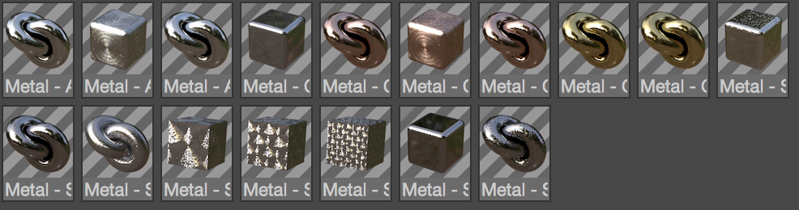

CV-Metal Material Presets
============================

[Cineversity.com](http://www.cineversity.com) presents 17 material presets for your texturing pleasure.

## Materials/Textures Include:

- Aluminum
- Radial Brushed Aluminum
- Rough Cast Aluminum
- Warped Chrome
- Copper
- Radial Brushed Copper
- Rough Cast Copper
- Gold
- Rough Cast Gold
- Rough Cast Silver
- Steel Material
- Large, Medium, and Small Brush Steel
- Pitted Steel Material
- Rough Cast Steel

## Installation Instructions

1. Copy the `CVMetalMaterials.lib4d` file from the `Preset` folder in this .zip file
2. Open Cinema 4D
3. `Edit > Preferences > Open Preferences Folder`
4. Browse to: `library > browser`
5. Paste the .lib4d file.
6. Restart Cinema 4D

## Usage Instructions

1. Open Cinema 4D
2. Open the Content Browser `Window > Content Browser...`
3. In the Tree View, navigate to `Presets > CV Metal Materials`
4. Click and drag any material from the content browser into your Material Manager.